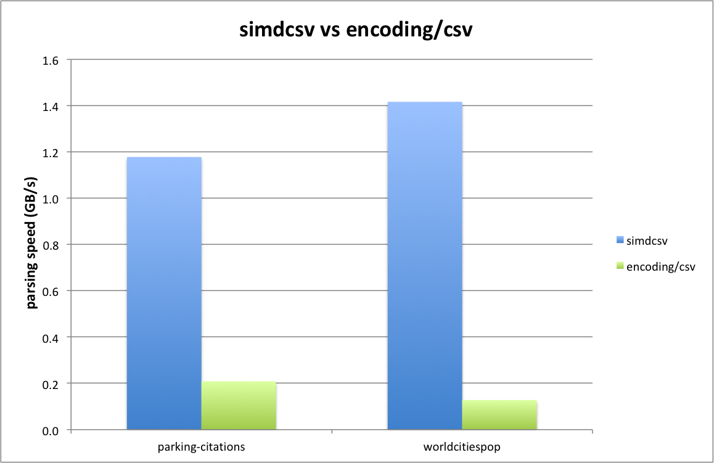

# simdcsv

**Experimental: do not use in production.**

A 2 stage design approach for speeding up CSV parsing (somewhat analoguous to [simdjson-go](https://github.com/minio/simdjson-go)).
    
## Design goals

- 1 GB/sec parsing performance for a single core
- support arbitrarily large data sets
- drop-in replacement for `encoding/csv`
- zero copy behaviour/memory efficient

## Two Stage Design

The design of `simdcsv` consists of two stages:
- stage 1: preprocess the CSV
- stage 2: parse CSV

Fundamentally `simdcsv` works on chunks of 64 bytes at a time which are loaded into a set of 2 YMM registers. Using AVX2 instructions the presence of characters such as separators, newline delimiters and quotes are detected and merged into a single 64-bit wide register.

## Stage 1: Preprocessing stage

The main job of the first stage is to a chunk of data for the presence of quoted fields. 

Within quoted fields some special processing is done for:
- double quotes (`""`): these are cleared in the corresponding mask in order to prevent the next step to treat it from being treated as either an opening or closing qoute.
- separator character: each separator character in a quoted field has its corresponding bit cleared so as to be skipped in the next step.

In addition all CVS data is scanned for carriage return characters followed by a newline character (`\r\n`):
- within quoted fields: the (`\r\n`) pair is marked as a position to be replaced with a single newline (`\n`) only during the next stage.
- everywhere else: the `\r` is marked to be a newline (`\n`) so that it will be treated as an empty line during the next stage (which are ignored).

In order to be able to detect double quotes and carriage return and newline pairs, for the last bit (63rd) it is necessary to look ahead to the next set of 64 bytes. So the first stage reads one chunk ahead and, upon finishing the current chunk, swaps the next chunk to the current chunk and loads the next set of 64 bytes to process.

Special care is taken to prevent errors such as segmentation violations in order to not (potentially) load beyond the end of the input buffer.

The result from the first stage is a set of three bit-masks:
- quote mask: mask indicating opening or closing quotes for quoted fields (excluding quote quotes)
- separator mask: mask for splitsing the row of CSV data into separate fields (excluding separator characters in quoted fields)
- carriage return mask: mask than indicate which carriage returns to treat as newlines

## Stage 2: Parsing stage

The second stage takes the (adjusted) bit masks from the first stage in order the work out the offsets of the individual fields into the originating buffer containing the CSV data.

To prevent needlessy copying (and allocating) strings out of buffer of CSV data, there is a single large slice to strings representing all  the columns for all the rows in the CSV data. Each string out of the columns slice points back into the appropriate starting position in the CSV data and the corresponding length for that particular field.

As the columns are parsed they are added to the same row (which is a slice of strings) until a delimiter in the form of an active bit in the newline mask is detected. The a new row is started to which the subsequent fields are added.

Note that empty rows are automatically skipped as well as multiple empty rows immediately following each other. Due to the fact that a carriage return character, immediately followed by a newline, is indicated from the first stage to be treated as a newline character, it both properly terminates the current row as well as preventing an empty row from being added (since `\r\n` is treated as two subsequent newlines (`\n\n`) but empty lines are filtered out).

For the large majority of the fields we have an optimized "zero-copy" memory optimized representation whereby the field is directly pointing back into the original buffer of CSV data.

However there are certain fields that require post-processing in order to have the correct representation (and meeting equivalence to how `encoding/csv` operates. These fields are all quoted fields that contain either a double quote or a carriage return and newline pair. The first stage outputs a rough indication of which fields require this post-processing and, upon completion of the second stage, a final `string.ReplaceAll()` is invoked on these fields (which then will contain a modified copy of the string out of the original CSV data).

## Example

Below is an example that illustrates the bit masks for the different identification characters as well as their interaction between both stages.  

The input data is a modified version of the example from `encoding\csv` with a couple of changes for cases that need proper handling:
 
```go
	instr := `first_name,last_name,username
"Rob","Pike",rob
Ken,Thompson,ken
"Robert","Griesemer","gri"
`

	instr = strings.Replace(instr, "\n", "\r\n", 1)                     // change regular newline into carriage return and newline pair
	instr = strings.Replace(instr, `"Rob"`, `"Ro""b"`, 1)               // pair of double quotes in quoted field that act as an escaped quote
	instr = strings.Replace(instr, `"Pike"`, `"Pi,ke"`, 1)              // separator character in quoted field that shoule be disabled
	instr = strings.Replace(instr, `"Robert"`, `"Rob`+"\r\n"+`ert"`, 1) // carriage return in quoted field followed by newline --> treated as newline
	instr = strings.Replace(instr, `"Griesemer"`, "Gries\remer", 1)     // carriage return in quoted field not followed by newline  --> not treated as newline
```

So the input data is as shown below in hexadecimal dump with a mix of carriage return and newline lines along with normally terminated lines. Also one quoted field contains a carriage return and newline pair (which `encoding\csv` filters out to just a newline character) as well as another quoted field that just contains a carriage return character which is copied unchanged to the resulting output.

```
=== RUN   TestExample
00000000  66 69 72 73 74 5f 6e 61  6d 65 2c 6c 61 73 74 5f  |first_name,last_|
00000010  6e 61 6d 65 2c 75 73 65  72 6e 61 6d 65 0d 0a 22  |name,username.."|
00000020  52 6f 22 22 62 22 2c 22  50 69 2c 6b 65 22 2c 72  |Ro""b","Pi,ke",r|
00000030  6f 62 0a 4b 65 6e 2c 54  68 6f 6d 70 73 6f 6e 2c  |ob.Ken,Thompson,|
00000040  6b 65 6e 0a 22 52 6f 62  0d 0a 65 72 74 22 2c 47  |ken."Rob..ert",G|
00000050  72 69 65 73 0d 65 6d 65  72 2c 22 67 72 69 22 0a  |ries.emer,"gri".|
00000060  00 00 00 00 00 00 00 00  00 00 00 00 00 00 00 00  |................|
00000070  00 00 00 00 00 00 00 00  00 00 00 00 00 00 00 00  |................|
```

The first stage detects the occurrence of quotes, separator, and carriage return characters (whereby the separator character can be specified by the user). Each mask is adjusted accordingly based on the "quoted" status of a field and/or the occurrence of double quotes or carriage return and newline pairs.

Below the input state for each bitmask is shown as well as its (adjusted) output state. For instance, for the test CSV data shown above, the bits for the double quote pair are filtered out for the quote mask and the separator character in the quoted field is cleared for the separator mask.

(NB: The `·` (high dot) in the middle is inserted purely for illustrational purposes to make it easier to distinguish between the first and second set of 64 bytes/bits)

```
         input: first_name,last_name,username  "Ro""b","Pi,ke",rob Ken,Thompson,·ken "Rob  ert",Gries emer,"gri" 
     quote-in : 0000000000000000000000000000000100110101000001000000000000000000·0000100000000100000000000010001000000000000000000000000000000000
     quote-out: 0000000000000000000000000000000100000101000001000000000000000000·0000100000000100000000000010001000000000000000000000000000000000
                                                  ^^                                                                                             
 separator-in : 0000000000100000000010000000000000000010001000100000001000000001·0000000000000010000000000100000000000000000000000000000000000000
 separator-out: 0000000000100000000010000000000000000010000000100000001000000001·0000000000000010000000000100000000000000000000000000000000000000
                                                          ^                                                                                      
  carriage-in : 0000000000000000000000000000010000000000000000000000000000000000·0000000010000000000010000000000000000000000000000000000000000000
  carriage-out: 0000000000000000000000000000010000000000000000000000000000000000·0000000000000000000000000000000000000000000000000000000000000000
                                                                                         ^           ^                                           
```

The bitmasks for the quotes and the separators are passed directly to the second stage. The delimiter mask is the OR of the  carriage return mask shown above in combination with the mask of newline characters from the original data.

```
        quotes: 0000000000000000000000000000000100000101000001000000000000000000·0000100000000100000000000010001000000000000000000000000000000000
     delimiter: 0000000000000000000000000000011000000000000000000010000000000000·0001000001000000000000000000000100000000000000000000000000000000
     separator: 0000000000100000000010000000000000000010000000100000001000000001·0000000000000010000000000100000000000000000000000000000000000000
         input: first_name,last_name,username  "Ro""b","Pi,ke",rob Ken,Thompson,·ken "Rob  ert",Gries emer,"gri" 
        row[0]: first_name last_name username                                   ·                                                                
        row[1]:                                 Ro""b   Pi,ke  rob              ·                                                                
        row[2]:                                                    Ken Thompson ·ken                                                             
        row[3]:                                                                 ·     Rob  ert  Gries emer  gri                                  
```

Based on the separator, delimiter and quote masks, the second stage works out where each field of each row starts (and ends) by pointing directly back into the original buffer. In case the field is quoted, both quotes are skipped, so effectively the content starts one position later and ends one position earlier.
 
For the vast majority of fields this immediately yields the desired result, except for quoted fields that contain either escaped quotes (see `Ro""b"` above) or a carriage return and newline pair that should be replaced with a newline character only (see `Rob  ert` above).

As such there is a final (small) postprocessing step that does a `strings.ReplaceAll()` for just the affected fields in order to make this correction. So only for these fields additional memory needs to be allocated and the behaviour is not "zero-copy". In case the CSV does not contain any fields that need this transformation this step is completely skipped (and note that the step is typically only applied to a very small number of fields, so the performance overhead is normally very low).

The table below shows the adjusted fields that are merge back into the overall results shown above.

```
        row[1]:                                 Ro"b                            ·                                                                
        row[3]:                                                                 ·     Rob ert                                                    
```

This then gives us the slice of slices of strings (`[][]string`) which contains the results of the `ReadAll()` operation.

The test code for this example is generated by the function `TestExample()` in `simdcsv_test.go`. So it is actually possible to modify the input data and see what the effects are on the individual masks and final result. Note that this code is for illustration purposes only as it just works up to CSV data of max. 128 characters (and is not performance optimized).  

##  Performance compared to encoding/csv



```
benchmark                                     old MB/s     new MB/s     speedup
BenchmarkSimdCsv/parking-citations-100K-8     208.64       1178.09      5.65x
BenchmarkSimdCsv/worldcitiespop-8             127.65       1416.61      11.10x

benchmark                                     old bytes     new bytes     delta
BenchmarkSimdCsv/parking-citations-100K-8     58601190      1181503       -97.98%
BenchmarkSimdCsv/worldcitiespop-8             933054464     27603772      -97.04%
```

## Benchmarking 

### Stage 1

```
benchmark              old MB/s     new MB/s     speedup
BenchmarkFirstPass     760.36       4495.12      5.91x
```

```
go test -v -run=X -bench=Stage1PreprocessingMasks
BenchmarkStage1PreprocessingMasks-8       281197              3746 ns/op        1708.47 MB/s
```

### Stage 2

```
benchmark                        old MB/s     new MB/s     speedup
BenchmarkStage2ParseBuffer-8     205.81       1448.64      7.04x
```

Strongly reduced memory allocations:
```
benchmark                        old allocs     new allocs     delta
BenchmarkStage2ParseBuffer-8     20034          0              -100.00%
```

## Limitations

`simdcsv` has the following limitations:
- `LazyQuotes` is not supported (fallback to `encoding/csv`)
- Non-ASCII characters for either Comma or Comment are not supported (fallback to `encoding/csv`)

## References

Ge, Chang and Li, Yinan and Eilebrecht, Eric and Chandramouli, Badrish and Kossmann, Donald, [Speculative Distributed CSV Data Parsing for Big Data Analytics](https://www.microsoft.com/en-us/research/publication/speculative-distributed-csv-data-parsing-for-big-data-analytics/), SIGMOD 2019.

[Awesome Comma-Separated Values](https://github.com/csvspecs/awesome-csv)

