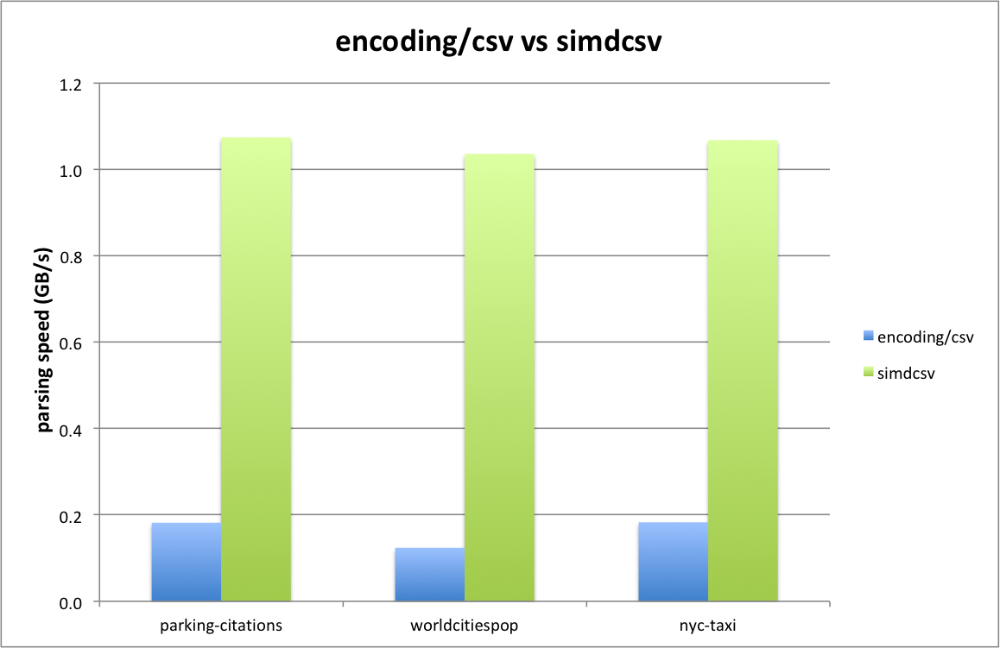

# simdcsv

**Experimental: do not use in production.**

A 2 stage design approach for speeding up CSV parsing (somewhat analoguous to [simdjson-go](https://github.com/minio/simdjson-go)).
    
## Design goals

- 1 GB/sec parsing performance for a single core
- support arbitrarily large data sets
- drop-in replacement for `encoding/csv`
- zero copy behaviour/memory efficient

## Two Stage Design

The design of `simdcsv` consists of two stages:
- stage 1: preprocess the CSV
- stage 2: parse CSV

Fundamentally `simdcsv` works on chunks of 64 bytes at a time which are loaded into a set of 2 YMM registers. Using AVX2 instructions the presence of characters such as separators, newline delimiters and quotes are detected and merged into a single 64-bit wide register.

## Stage 1: Preprocessing stage

The main job of the first stage is to a chunk of data for the presence of quoted fields. 

Within quoted fields some special processing is done for:
- double quotes (`""`): these are cleared in the corresponding mask in order to prevent the next step to treat it from being treated as either an opening or closing qoute.
- separator character: each separator character in a quoted field has its corresponding bit cleared so as to be skipped in the next step.

In addition all CVS data is scanned for carriage return characters followed by a newline character (`\r\n`):
- within quoted fields: the (`\r\n`) pair is marked as a position to be replaced with a single newline (`\n`) only during the next stage.
- everywhere else: the `\r` is marked to be a newline (`\n`) so that it will be treated as an empty line during the next stage (which are ignored).

In order to be able to detect double quotes and carriage return and newline pairs, for the last bit (63rd) it is necessary to look ahead to the next set of 64 bytes. So the first stage reads one chunk ahead and, upon finishing the current chunk, swaps the next chunk to the current chunk and loads the next set of 64 bytes to process.

Special care is taken to prevent errors such as segmentation violations in order to not (potentially) load beyond the end of the input buffer.

The result from the first stage is a set of three bit-masks:
- quote mask: mask indicating opening or closing quotes for quoted fields (excluding quote quotes)
- separator mask: mask for splitsing the row of CSV data into separate fields (excluding separator characters in quoted fields)
- carriage return mask: mask than indicate which carriage returns to treat as newlines

## Stage 2: Parsing stage

The second stage takes the (adjusted) bit masks from the first stage in order the work out the offsets of the individual fields into the originating buffer containing the CSV data.

To prevent needlessy copying (and allocating) strings out of buffer of CSV data, there is a single large slice to strings representing all  the columns for all the rows in the CSV data. Each string out of the columns slice points back into the appropriate starting position in the CSV data and the corresponding length for that particular field.

As the columns are parsed they are added to the same row (which is a slice of strings) until a delimiter in the form of an active bit in the newline mask is detected. The a new row is started to which the subsequent fields are added.

Note that empty rows are automatically skipped as well as multiple empty rows immediately following each other. Due to the fact that a carriage return character, immediately followed by a newline, is indicated from the first stage to be treated as a newline character, it both properly terminates the current row as well as preventing an empty row from being added (since `\r\n` is treated as two subsequent newlines (`\n\n`) but empty lines are filtered out).

For the large majority of the fields we have an optimized "zero-copy" memory optimized representation whereby the field is directly pointing back into the original buffer of CSV data.

However there are certain fields that require post-processing in order to have the correct representation (and meeting equivalence to how `encoding/csv` operates. These fields are all quoted fields that contain either a double quote or a carriage return and newline pair. The first stage outputs a rough indication of which fields require this post-processing and, upon completion of the second stage, a final `string.ReplaceAll()` is invoked on these fields (which then will contain a modified copy of the string out of the original CSV data).

## Example

Below is an example that illustrates the bit masks for the different identification characters as well as their interaction between both stages.  

```
=== RUN   TestExample
00000000  66 69 72 73 74 5f 6e 61  6d 65 2c 6c 61 73 74 5f  |first_name,last_|
00000010  6e 61 6d 65 2c 75 73 65  72 6e 61 6d 65 0d 0a 22  |name,username.."|
00000020  52 6f 22 22 62 22 2c 22  50 69 2c 6b 65 22 2c 72  |Ro""b","Pi,ke",r|
00000030  6f 62 0a 4b 65 6e 2c 54  68 6f 6d 70 73 6f 6e 2c  |ob.Ken,Thompson,|
00000040  6b 65 6e 0a 52 6f 62 0d  0a 65 72 74 2c 47 72 69  |ken.Rob..ert,Gri|
00000050  65 73 0d 65 6d 65 72 2c  22 67 72 69 22 0a 00 00  |es.emer,"gri"...|
00000060  00 00 00 00 00 00 00 00  00 00 00 00 00 00 00 00  |................|
00000070  00 00 00 00 00 00 00 00  00 00 00 00 00 00 00 00  |................|

         input: first_name,last_name,username  "Ro""b","Pi,ke",rob Ken,Thompson,·ken Rob  ert,Gries emer,"gri" 
     quote-in : 0000000000000000000000000000000100110101000001000000000000000000·0000000000000000000000001000100000000000000000000000000000000000
     quote-out: 0000000000000000000000000000000100000101000001000000000000000000·0000000000000000000000001000100000000000000000000000000000000000
                                                  ^^                                                                                             
 separator-in : 0000000000100000000010000000000000000010001000100000001000000001·0000000000001000000000010000000000000000000000000000000000000000
 separator-out: 0000000000100000000010000000000000000010000000100000001000000001·0000000000001000000000010000000000000000000000000000000000000000
                                                          ^                                                                                      
  carriage-in : 0000000000000000000000000000010000000000000000000000000000000000·0000000100000000001000000000000000000000000000000000000000000000
  carriage-out: 0000000000000000000000000000010000000000000000000000000000000000·0000000100000000000000000000000000000000000000000000000000000000
                                                                                                   ^                                             
```

```
     delimiter: 0000000000000000000000000000011000000000000000000010000000000000·0001000110000000000000000000010000000000000000000000000000000000
     separator: 0000000000100000000010000000000000000010000000100000001000000001·0000000000001000000000010000000000000000000000000000000000000000
         input: first_name,last_name,username  "Ro""b","Pi,ke",rob Ken,Thompson,·ken Rob  ert,Gries emer,"gri" 
        quotes: 0000000000000000000000000000000100000101000001000000000000000000·0000000000000000000000001000100000000000000000000000000000000000

          row0: first_name last_name username 
          row1:                                 Ro""b   Pi,ke  rob 
          row2:                                                    Ken Thompson ·ken 
          row3:                                                                 ·    Rob  ert Gries emer  gri 
```

```
          row0: first_name last_name username 
          row1:                                 Ro"b    Pi,ke  rob 
          row2:                                                    Ken Thompson ·ken 
          row3:                                                                 ·    Rob ert  Gries emer  gri 
```

##  Performance compared to encoding/csv



```
benchmark                                     old MB/s     new MB/s     speedup
BenchmarkSimdCsv/parking-citations-100K-8     208.64       1178.09      5.65x
BenchmarkSimdCsv/worldcitiespop-8             127.65       1416.61      11.10x

benchmark                                     old bytes     new bytes     delta
BenchmarkSimdCsv/parking-citations-100K-8     58601190      1181503       -97.98%
BenchmarkSimdCsv/worldcitiespop-8             933054464     27603772      -97.04%
```

## Benchmarking 

### Stage 1

```
benchmark              old MB/s     new MB/s     speedup
BenchmarkFirstPass     760.36       4495.12      5.91x
```

```
go test -v -run=X -bench=Stage1PreprocessingMasks
BenchmarkStage1PreprocessingMasks-8       281197              3746 ns/op        1708.47 MB/s
```

### Stage 2

```
benchmark                        old MB/s     new MB/s     speedup
BenchmarkStage2ParseBuffer-8     205.81       1448.64      7.04x
```

Strongly reduced memory allocations:
```
benchmark                        old allocs     new allocs     delta
BenchmarkStage2ParseBuffer-8     20034          0              -100.00%
```

## Limitations

`simdcsv` has the following limitations:
- `LazyQuotes` is not supported (fallback to `encoding/csv`)
- Non-ASCII characters for either Comma or Comment are not supported (fallback to `encoding/csv`)

## References

Ge, Chang and Li, Yinan and Eilebrecht, Eric and Chandramouli, Badrish and Kossmann, Donald, [Speculative Distributed CSV Data Parsing for Big Data Analytics](https://www.microsoft.com/en-us/research/publication/speculative-distributed-csv-data-parsing-for-big-data-analytics/), SIGMOD 2019.

[Awesome Comma-Separated Values](https://github.com/csvspecs/awesome-csv)

